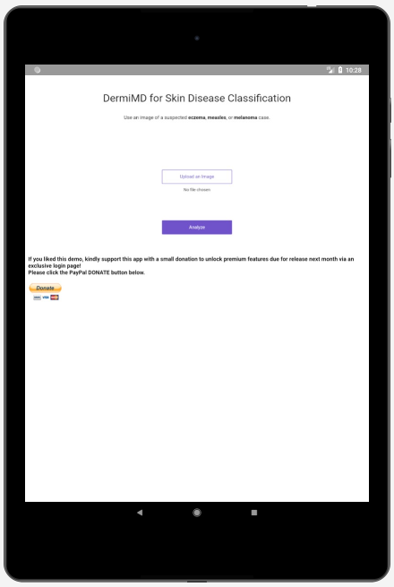
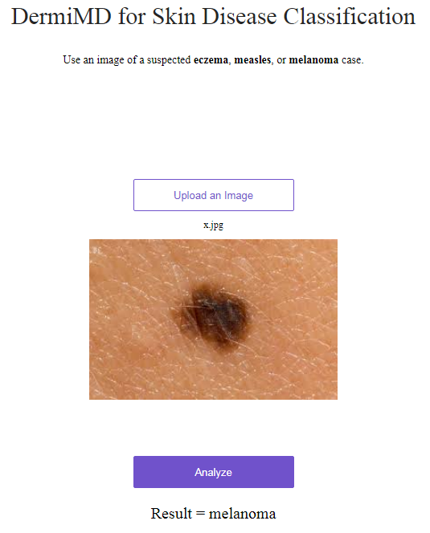

# Attribution: All code sourced from fastai course 2019.

# Final (Team Project - Build a Startup)

## Midterm project has been converted to an Android app and displayed through an emulator - screenshot below.

 
 
 
  
  
 
 ## The Android APK file "dermatitisdetector.apk" will be included in this repository.
 

# Midterm Assignment (Build an AI Startup)

# The production deployment of the app: https://dermatitisdetector.onrender.com/

## Team members: 
## 1. ainanami2018@gmail.com (Iman Idris)
## 2. pursh2002@gmail.com (Dr Purushottam)
## 3. choudhury.michael@gmail.com (Michael Choudhury)

## Classification service for trainee dermatologists to help diagnose skin diseases using a simple web app programmed in Python-3.
## ML/DL frameworks used: Fastai computer vision; PyTorch

## How to use the web app?
- ### Choose an image of a case of eczema, measles, or melanoma using google or take a photo using a smart phone
- ### Save the image to your PC
- ### Upload the image to the app
- ### Click the 'Analyze' button
- ### Read the result

     

# https://dermatitisdetector.onrender.com/

